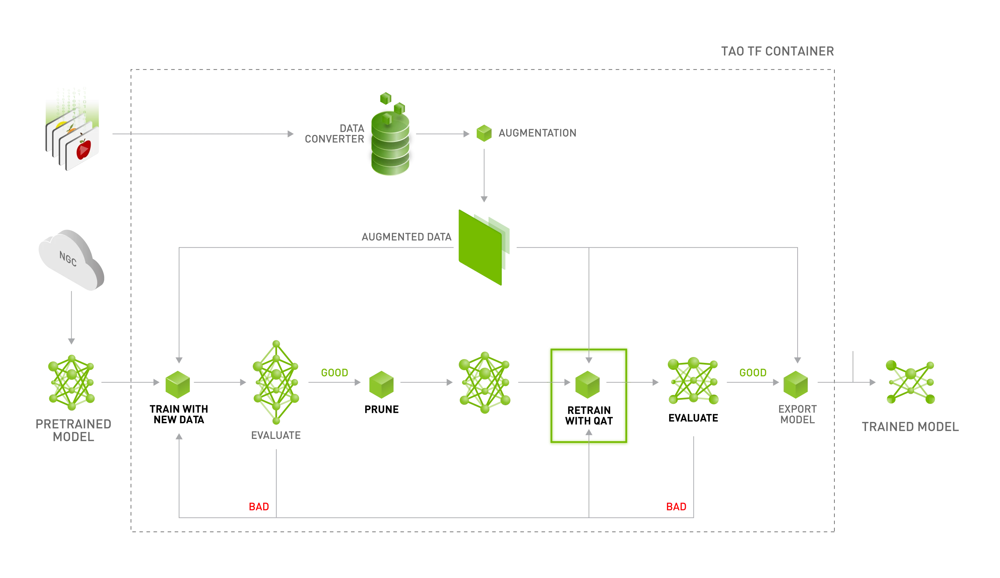

# WE2 with NVIDIA TAO Toolkit
[NVIDIA TAO Toolkit](https://docs.nvidia.com/tao/tao-toolkit/text/overview.html) is a low-code AI toolkit built on TensorFlow and PyTorch. 
The following demonstrates using the TAO PeopleNet pre-trained model for training, pruning, and QAT with the TAO Toolkit. The model is then converted to vela.tflite using [ethos-u-vela](https://review.mlplatform.org/plugins/gitiles/ml/ethos-u/ethos-u-vela/), and finally, inference the model on WE2.



## Reference
- https://docs.nvidia.com/tao/tao-toolkit/text/cv_finetuning/tensorflow_1/object_detection/detectnet_v2.html
- https://www.hackster.io/sandeep-mistry/nvidia-tao-object-detection-ml-models-on-arm-based-devices-3e51fb

## Prerequisites
- [TAO Toolkit](https://docs.nvidia.com/tao/tao-toolkit/text/quick_start_guide/index.html)
- OpenVINO and openvino2tensorflow 
    ```
    pip install openvino_dev openvino2tensorflow tensorflow tensorflow_datasets
    ```
- [ethos-u-vela](https://review.mlplatform.org/plugins/gitiles/ml/ethos-u/ethos-u-vela/)
- [PeopleNet](https://catalog.ngc.nvidia.com/orgs/nvidia/teams/tao/models/peoplenet) - Tao pre-trained model
Based on the NVIDIA DetectNet_v2 detector with ResNet34 as the feature extractor, it is trained on three categories: persons, bags, and faces.

## Demonstration
### Pre-processing the Dataset
DetectNet_v2 requires input in TFRecords format, which can be converted using the dataset_convert subtask provided by TAO. Currently, KITTI and COCO formats are supported. This demonstration uses the COCO dataset.

Arrange your dataset into the correct folder structure. 
```
data/
    ├── coco_data/
        ├── coco2017/
            ├── train2017/
            ├── val2017/
            └── annotations/
                ├── instances_train2017.json
                └── instances_val2017.json
specs/
    ├── coco_config
```
Please configure `~/.tao_mounts.json` to set the local path corresponding to the Docker path.
```
{
    "Mounts": [
        {
            "source": "/path/to/your/data",
            "destination": "/workspace/tao-experiments/data"
        },
        {
            "source": "/path/to/your/results",
            "destination": "/workspace/tao-experiments/results"
        },
        {
            "source": "/path/to/your/specs",
            "destination": "/workspace/tao-experiments/specs"
        }
    ]
}
```
Run the command to convert the dataset.
```
tao model detectnet_v2 dataset_convert -d /workspace/tao-experiments/specs/coco_config -o /workspace/tao-experiments/data/coco_data/tfrecord/
```
```
2024-08-12 13:51:23,448 [TAO Toolkit] [INFO] root 160: Registry: ['nvcr.io']
2024-08-12 13:51:23,641 [TAO Toolkit] [INFO] nvidia_tao_cli.components.instance_handler.local_instance 361: Running command in container: nvcr.io/nvidia/tao/tao-toolkit:5.0.0-tf1.15.5

...

parkingmeter: parkingmeter
toaster: toaster
hairdrier: hairdrier
For the dataset_config in the experiment_spec, please use labels in the tfrecords file, while writing the classmap.

2024-08-12 05:52:07,902 [TAO Toolkit] [INFO] nvidia_tao_tf1.cv.detectnet_v2.dataio.coco_converter_lib 254: Tfrecords generation complete.
2024-08-12 05:52:07,902 [TAO Toolkit] [INFO] nvidia_tao_tf1.cv.detectnet_v2.dataio.dataset_converter_lib 221: Writing the log_warning.json
2024-08-12 05:52:07,903 [TAO Toolkit] [INFO] nvidia_tao_tf1.cv.detectnet_v2.dataio.dataset_converter_lib 224: There were errors in the labels. Details are logged at /workspace/tao-experiments/data/coco_data/tfrecord/_waring.json
```

### Training the Model
To run the DetectNet_v2 training command, you must set up a spec file. For detailed settings on the spec file, you can refer to [#creating-a-configuration-file-detectnet-v2](https://docs.nvidia.com/tao/tao-toolkit/text/cv_finetuning/tensorflow_1/object_detection/detectnet_v2.html#creating-a-configuration-file). In this example, the spec file specifies the PeopleNet pretrained model as the `pretrained_model_file`. Please place the `model.hdf5` in the `/spec` folder.
The following is the DetectNet_v2 training command executed with the `detectnet_v2_spect_coco.txt` spec file. The results will be stored in `/path/to/your/results/detectnet_v2_spect_coco`
```
tao model detectnet_v2 train -e /workspace/tao-experiments/specs/detectnet_v2_spect_coco.txt -r /workspace/tao-experiments/results/detectnet_v2_spect_coco
```
```
Matching predictions to ground truth, class 1/1.: 100%|█████████████████████████████████████████████████████████████████████████████████████████████████████████████████████| 4835/4835 [00:00<00:00, 29413.46it/s]
Epoch 120/120
=========================

Validation cost: 0.003051
Mean average_precision (in %): 40.3805

+------------+--------------------------+
| class name | average precision (in %) |
+------------+--------------------------+
|   person   |    40.38046396159004     |
+------------+--------------------------+

Median Inference Time: 0.000794
2024-08-14 04:30:31,803 [TAO Toolkit] [INFO] root 2102: Evaluation metrics generated.
2024-08-14 04:30:31,804 [TAO Toolkit] [INFO] root 2102: Training loop completed.
2024-08-14 04:30:31,804 [TAO Toolkit] [INFO] root 2102: Saving trained model.
2024-08-14 04:30:31,996 [TAO Toolkit] [INFO] root 2102: Model saved.
WARNING:tensorflow:From /usr/local/lib/python3.8/dist-packages/keras/backend/tensorflow_backend.py:95: The name tf.reset_default_graph is deprecated. Please use tf.compat.v1.reset_default_graph instead.

2024-08-14 04:30:31,997 [TAO Toolkit] [WARNING] tensorflow 137: From /usr/local/lib/python3.8/dist-packages/keras/backend/tensorflow_backend.py:95: The name tf.reset_default_graph is deprecated. Please use tf.compat.v1.reset_default_graph instead.

WARNING:tensorflow:From /usr/local/lib/python3.8/dist-packages/keras/backend/tensorflow_backend.py:98: The name tf.placeholder_with_default is deprecated. Please use tf.compat.v1.placeholder_with_default instead.

2024-08-14 04:30:31,997 [TAO Toolkit] [WARNING] tensorflow 137: From /usr/local/lib/python3.8/dist-packages/keras/backend/tensorflow_backend.py:98: The name tf.placeholder_with_default is deprecated. Please use tf.compat.v1.placeholder_with_default instead.

2024-08-14 04:30:32,000 [TAO Toolkit] [INFO] nvidia_tao_tf1.core.hooks.sample_counter_hook 85: Train Samples / sec: 1192.079
2024-08-14 04:30:32,567 [TAO Toolkit] [INFO] root 2102: Training op complete.
2024-08-14 04:30:32,570 [TAO Toolkit] [INFO] root 2102: DetectNet_v2 training job complete.
```

### Pruning
TAO provides a pruning tool to trim the model based on a specified threshold. In this example, we will perform pruning in two stages to optimize SRAM usage, and the final model is pruned to approximately 10% of its original size.

Step one
```
tao model detectnet_v2 prune \
-m /workspace/tao-experiments/results/detectnet_v2_spect_coco/weights/model.hdf5 \
-o /workspace/tao-experiments/results/detectnet_v2_spect_coco/weights/model_pruning_1.hdf5 \
-pth 0.9 \
-el block_1b_conv_1 block_1b_conv_2 \
block_1b_conv_shortcut block_1c_conv_1 block_1c_conv_2 \
block_1c_conv_shortcut block_2a_conv_1 block_2a_conv_2 \
block_2a_conv_shortcut block_2b_conv_1 block_2b_conv_2 \
block_2b_conv_shortcut block_2c_conv_1 block_2c_conv_2 \
block_2c_conv_shortcut block_2d_conv_1 block_2d_conv_2 \
block_2d_conv_shortcut block_3a_conv_1 block_3a_conv_2 \
block_3a_conv_shortcut block_3b_conv_1 block_3b_conv_2 \
block_3b_conv_shortcut block_3c_conv_1 block_3c_conv_2 \
block_3c_conv_shortcut block_3d_conv_1 block_3d_conv_2 \
block_3d_conv_shortcut block_3e_conv_1 block_3e_conv_2 \
block_3e_conv_shortcut block_3f_conv_1 block_3f_conv_2 \
block_3f_conv_shortcut  block_4a_conv_1 block_4b_conv_1 \
block_4c_conv_1 block_4a_conv_2 block_4b_conv_2 \
block_4c_conv_2 block_4a_conv_shortcut \
block_4b_conv_shortcut block_4c_conv_shortcut
```
```
2024-08-21 08:13:11,876 [TAO Toolkit] [INFO] nvidia_tao_tf1.core.pruning.pruning 981: Exploring graph for retainable indices
2024-08-21 08:13:13,329 [TAO Toolkit] [INFO] nvidia_tao_tf1.core.pruning.pruning 1225: Pruning model and appending pruned nodes to new graph
2024-08-21 08:13:59,351 [TAO Toolkit] [INFO] nvidia_tao_tf1.cv.common.magnet_prune 224: Pruning ratio (pruned model / original model): 0.9953842932430587
```
Step two
```
tao model detectnet_v2 prune \
-m /workspace/tao-experiments/results/detectnet_v2_spect_coco/weights/model_pruning_1.hdf5 \
-o /workspace/tao-experiments/results/detectnet_v2_spect_coco/weights/model_pruning_2.hdf5 \
-pth 0.8 \
-el conv1 block_1a_conv_1 block_1a_conv_2 block_1a_conv_shortcut
```
```
2024-08-21 08:46:09,132 [TAO Toolkit] [INFO] nvidia_tao_tf1.core.pruning.pruning 981: Exploring graph for retainable indices
2024-08-21 08:46:10,529 [TAO Toolkit] [INFO] nvidia_tao_tf1.core.pruning.pruning 1225: Pruning model and appending pruned nodes to new graph
2024-08-21 08:46:55,826 [TAO Toolkit] [INFO] nvidia_tao_tf1.cv.common.magnet_prune 224: Pruning ratio (pruned model / original model): 0.09523263810858515
```

Re-training is required after pruning. In this example, the `detectnet_v2_spect_coco_pruning.txt` spec file is used for re-training.
```
tao model detectnet_v2 train -e /workspace/tao-experiments/specs/detectnet_v2_spect_coco_pruning.txt -r /workspace/tao-experiments/results/detectnet_v2_spect_coco_pruning
```
```
Matching predictions to ground truth, class 1/1.: 100%|█████████████████████████████████████████████████████████████████████████████████████████████████████████████████████| 2494/2494 [00:00<00:00, 28960.27it/s]
Epoch 120/120
=========================

Validation cost: 0.003603
Mean average_precision (in %): 21.3152

+------------+--------------------------+
| class name | average precision (in %) |
+------------+--------------------------+
|   person   |    21.315197663688227    |
+------------+--------------------------+

Median Inference Time: 0.000680
2024-08-21 11:23:36,497 [TAO Toolkit] [INFO] root 2102: Evaluation metrics generated.
2024-08-21 11:23:36,497 [TAO Toolkit] [INFO] root 2102: Training loop completed.
2024-08-21 11:23:36,498 [TAO Toolkit] [INFO] root 2102: Saving trained model.
2024-08-21 11:23:36,618 [TAO Toolkit] [INFO] root 2102: Model saved.
WARNING:tensorflow:From /usr/local/lib/python3.8/dist-packages/keras/backend/tensorflow_backend.py:95: The name tf.reset_default_graph is deprecated. Please use tf.compat.v1.reset_default_graph instead.

2024-08-21 11:23:36,619 [TAO Toolkit] [WARNING] tensorflow 137: From /usr/local/lib/python3.8/dist-packages/keras/backend/tensorflow_backend.py:95: The name tf.reset_default_graph is deprecated. Please use tf.compat.v1.reset_default_graph instead.

WARNING:tensorflow:From /usr/local/lib/python3.8/dist-packages/keras/backend/tensorflow_backend.py:98: The name tf.placeholder_with_default is deprecated. Please use tf.compat.v1.placeholder_with_default instead.

2024-08-21 11:23:36,619 [TAO Toolkit] [WARNING] tensorflow 137: From /usr/local/lib/python3.8/dist-packages/keras/backend/tensorflow_backend.py:98: The name tf.placeholder_with_default is deprecated. Please use tf.compat.v1.placeholder_with_default instead.

2024-08-21 11:23:36,620 [TAO Toolkit] [INFO] nvidia_tao_tf1.core.hooks.sample_counter_hook 85: Train Samples / sec: 1565.984
2024-08-21 11:23:36,980 [TAO Toolkit] [INFO] root 2102: Training op complete.
2024-08-21 11:23:36,982 [TAO Toolkit] [INFO] root 2102: DetectNet_v2 training job complete.
```

### QAT
Using the `detectnet_v2_spect_coco_pruning_qat.txt` spec file, enable the `enable_qat` parameter to train the model with Quantization Aware Training.
```
tao model detectnet_v2 train -e /workspace/tao-experiments/specs/detectnet_v2_spect_coco_pruning_qat.txt -r /workspace/tao-experiments/results/detectnet_v2_spect_coco_pruning_qat
```
```
Matching predictions to ground truth, class 1/1.: 100%|█████████████████████████████████████████████████████████████████████████████████████████████████████████████████████| 2329/2329 [00:00<00:00, 29259.20it/s]
Epoch 120/120
=========================

Validation cost: 0.003675
Mean average_precision (in %): 19.7684

+------------+--------------------------+
| class name | average precision (in %) |
+------------+--------------------------+
|   person   |    19.768363721648882    |
+------------+--------------------------+

Median Inference Time: 0.001314
2024-08-22 04:58:18,656 [TAO Toolkit] [INFO] root 2102: Evaluation metrics generated.
2024-08-22 04:58:18,657 [TAO Toolkit] [INFO] root 2102: Training loop completed.
2024-08-22 04:58:18,658 [TAO Toolkit] [INFO] root 2102: Saving trained model.
2024-08-22 04:58:18,832 [TAO Toolkit] [INFO] root 2102: Model saved.
WARNING:tensorflow:From /usr/local/lib/python3.8/dist-packages/keras/backend/tensorflow_backend.py:95: The name tf.reset_default_graph is deprecated. Please use tf.compat.v1.reset_default_graph instead.

2024-08-22 04:58:18,833 [TAO Toolkit] [WARNING] tensorflow 137: From /usr/local/lib/python3.8/dist-packages/keras/backend/tensorflow_backend.py:95: The name tf.reset_default_graph is deprecated. Please use tf.compat.v1.reset_default_graph instead.

WARNING:tensorflow:From /usr/local/lib/python3.8/dist-packages/keras/backend/tensorflow_backend.py:98: The name tf.placeholder_with_default is deprecated. Please use tf.compat.v1.placeholder_with_default instead.

2024-08-22 04:58:18,833 [TAO Toolkit] [WARNING] tensorflow 137: From /usr/local/lib/python3.8/dist-packages/keras/backend/tensorflow_backend.py:98: The name tf.placeholder_with_default is deprecated. Please use tf.compat.v1.placeholder_with_default instead.

2024-08-22 04:58:18,835 [TAO Toolkit] [INFO] nvidia_tao_tf1.core.hooks.sample_counter_hook 85: Train Samples / sec: 1029.908
2024-08-22 04:58:19,761 [TAO Toolkit] [INFO] root 2102: Training op complete.
2024-08-22 04:58:19,763 [TAO Toolkit] [INFO] root 2102: DetectNet_v2 training job complete.
```

### Exporting the Model
Using TAO's `export` command, you can export the model to ONNX format. 
```
tao model detectnet_v2 export -m /workspace/tao-experiments/results/detectnet_v2_spect_coco_pruning_qat/weights/model.hdf5 -o /workspace/tao-experiments/results/detectnet_v2_spect_coco_pruning_qat/weights/model.onnx --onnx_route tf2onnx
```
```
...
2024-08-22 05:24:29,795 [TAO Toolkit] [INFO] tf2onnx.tfonnx 45: folding node using tf type=Identity, name=block_4c_conv_shortcut/bias/read
2024-08-22 05:24:29,795 [TAO Toolkit] [INFO] tf2onnx.tfonnx 45: folding node using tf type=Mul, name=block_4c_bn_2/batchnorm/mul
2024-08-22 05:24:29,795 [TAO Toolkit] [INFO] tf2onnx.tfonnx 45: folding node using tf type=Sub, name=block_4c_bn_2/batchnorm/sub
2024-08-22 05:24:29,796 [TAO Toolkit] [INFO] tf2onnx.tfonnx 45: folding node using tf type=Mul, name=block_4c_bn_shortcut/batchnorm/mul
2024-08-22 05:24:29,796 [TAO Toolkit] [INFO] tf2onnx.tfonnx 45: folding node using tf type=Sub, name=block_4c_bn_shortcut/batchnorm/sub
2024-08-22 05:24:29,796 [TAO Toolkit] [INFO] tf2onnx.tfonnx 45: folding node using tf type=Identity, name=output_bbox/kernel/read
2024-08-22 05:24:29,796 [TAO Toolkit] [INFO] tf2onnx.tfonnx 45: folding node using tf type=Identity, name=output_bbox/bias/read
2024-08-22 05:24:29,796 [TAO Toolkit] [INFO] tf2onnx.tfonnx 45: folding node using tf type=Identity, name=output_cov/kernel/read
2024-08-22 05:24:29,796 [TAO Toolkit] [INFO] tf2onnx.tfonnx 45: folding node using tf type=Identity, name=output_cov/bias/read
2024-08-22 05:24:29,961 [TAO Toolkit] [INFO] tf2onnx.optimizer 48: Optimizing ONNX model
2024-08-22 05:24:30,897 [TAO Toolkit] [INFO] tf2onnx.optimizer 83: After optimization: Const -99 (301->202), Identity -2 (2->0), Reshape -35 (35->0)
```

Then, use OpenVINO to convert it to a TensorFlow model, and use TFLiteConverter to convert it to an int8 TFLite model.

```
python remove_suffix.py --input /path/to/your/results/detectnet_v2_spect_coco_pruning_qat/weights/model.onnx --output /path/to/your/results/detectnet_v2_spect_coco_pruning_qat/weights/model_ex.onnx

mo --input_model /path/to/your/results/detectnet_v2_spect_coco_pruning_qat/weights/model_ex.onnx --input_shape "[1,3,240,320]" --output_dir /path/to/your/results/detectnet_v2_spect_coco_pruning_qat/weights/model_openvino --compress_to_fp16=False

openvino2tensorflow --model_path /path/to/your/results/detectnet_v2_spect_coco_pruning_qat/weights/model_openvino/model_ex.xml  --model_output_path /path/to/your/results/detectnet_v2_spect_coco_pruning_qat/weights/model_tf --non_verbose --output_saved_model

python tflite_pb.py --input /path/to/your/results/detectnet_v2_spect_coco_pruning_qat/weights/model_tf --output /path/to/your/results/detectnet_v2_spect_coco_pruning_qat/weights/model.tflite
```

Finally, convert it to vela.tflite using ethos-u-vela.
```
vela --accelerator-config ethos-u55-64 --config vela_setting_v1.ini --system-config My_Sys_Cfg --memory-mode My_Mem_Mode_Parent --output-dir /path/to/your/results/detectnet_v2_spect_coco_pruning_qat/weights/model_vela /path/to/your/results/detectnet_v2_spect_coco_pruning_qat/weights/model.tflite
```
```
Network summary for model
Accelerator configuration                Ethos_U55_64
System configuration                       My_Sys_Cfg
Memory mode                        My_Mem_Mode_Parent
Accelerator clock                                 400 MHz
Design peak SRAM bandwidth                       3.20 GB/s
Design peak Off-chip Flash bandwidth             0.05 GB/s

Total SRAM used                                959.11 KiB
Total Off-chip Flash used                     1965.59 KiB

CPU operators = 0 (0.0%)
NPU operators = 68 (100.0%)

Average SRAM bandwidth                           0.69 GB/s
Input   SRAM bandwidth                          30.86 MB/batch
Weight  SRAM bandwidth                          36.80 MB/batch
Output  SRAM bandwidth                           6.40 MB/batch
Total   SRAM bandwidth                          74.10 MB/batch
Total   SRAM bandwidth            per input     74.10 MB/inference (batch size 1)

Average Off-chip Flash bandwidth                 0.02 GB/s
Input   Off-chip Flash bandwidth                 0.00 MB/batch
Weight  Off-chip Flash bandwidth                 1.96 MB/batch
Output  Off-chip Flash bandwidth                 0.00 MB/batch
Total   Off-chip Flash bandwidth                 1.96 MB/batch
Total   Off-chip Flash bandwidth  per input      1.96 MB/inference (batch size 1)

Original Weights Size                         2041.96 KiB
NPU Encoded Weights Size                      1917.77 KiB

Neural network macs                        1786123200 MACs/batch
Network Tops/s                                   0.03 Tops/s

NPU cycles                                   42929366 cycles/batch
SRAM Access cycles                            4919702 cycles/batch
DRAM Access cycles                                  0 cycles/batch
On-chip Flash Access cycles                         0 cycles/batch
Off-chip Flash Access cycles                        0 cycles/batch
Total cycles                                 42964246 cycles/batch

Batch Inference time               107.41 ms,    9.31 inferences/s (batch size 1)
```
The results will be stored in `/path/to/your/results/detectnet_v2_spect_coco_pruning_qat/weights/model_vela/model_vela.tflite`
### Inference the model on WE2
After you generate the `model_vela.tflite`, you can reference the [tflm_peoplenet](https://github.com/HimaxWiseEyePlus/Seeed_Grove_Vision_AI_Module_V2/blob/main/EPII_CM55M_APP_S/app/scenario_app/tflm_peoplenet/README.md) at the Himax offical repository to deploy to WE2.